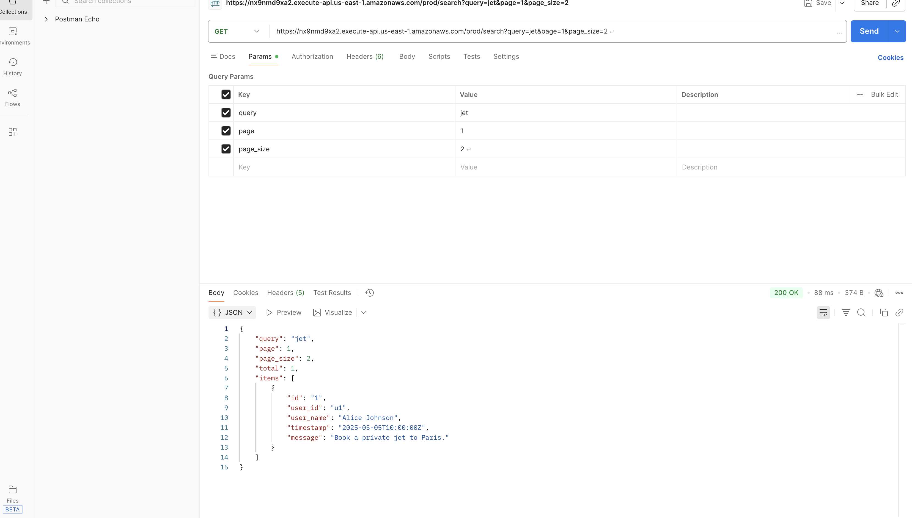

# Message Search API

A fast, serverless search API built on top of a slow, paginated upstream data source.  
Designed to meet the assignment requirement: **return results in < 100 ms** while **avoiding direct calls** to the upstream API on every request.

## Features

- Public HTTP API `/search`
- Fast Python in-process search (no upstream calls during user requests)
- Daily data refresh using EventBridge cron
- Python Lambda backend with Pydantic validation
- Clean pagination (`page`, `page_size`)
- Fully serverless (AWS Lambda + API Gateway)
- Deployable & publicly accessible

## Tech Stack

- Python (latest stable)
- AWS Lambda
- AWS API Gateway (HTTP API)
- AWS EventBridge (Cron Schedule)
- Pydantic v1
- Requests (used once per daily refresh)

## API Usage

`GET /search?query=jet&page=1&page_size=5`

### Example Response

```json
{
  "query": "jet",
  "page": 1,
  "page_size": 5,
  "total": 1,
  "items": [
    {
      "id": "1",
      "user_id": "u1",
      "user_name": "Alice",
      "timestamp": "2025-05-05T10:00:00Z",
      "message": "Book a private jet to Paris."
    }
  ]
}
```

## Example Search Request (Postman)

Below is an example of the `/search` endpoint working with query parameters:



## Architecture Diagram


## Deployment Steps

### 1. Create Python venv

```bash
python3.12 -m venv .venv
source .venv/bin/activate
```

### 2. Install dependencies

```bash
pip install "pydantic==1.10.15" requests
```

### 3. Build Lambda package

```bash
deactivate
rm -rf build lambda.zip
mkdir build

# Copy dependencies
cp -r .venv/lib/python3.12/site-packages/* build/

# Copy application source code
cp -r lambda_src/message_search build/message_search

# Create ZIP file
cd build
zip -r ../lambda.zip .
cd ..
```

### 4. Upload to AWS Lambda
### 5. API Gateway Setup
### 6. EventBridge Setup

## Design Notes - Bonus1

### Goals and Constraints

- The upstream API is slow.
- The assignment requires results under **100 ms**.
- The service must be publicly accessible.

**Key Idea:**  
Decouple “fetching data from source” from “serving search queries.”

## Option A (Chosen): Single Lambda + EventBridge Scheduled Refresh

- Lambda exposes `/search` through API Gateway.
- A daily EventBridge cron rule invokes Lambda with:
  ```json
  {"source": "cron.refresh"}
  ```

### 1. Refresh mode
- Calls the slow upstream API once with a large limit.
- Rebuilds a list of messages (validated with Pydantic).

### 2. Search mode
- Uses the already-loaded list to filter results.
- Consistently returns responses in **well under 100 ms** (except cold starts).

### How Lambda stores the data

- Lambda loads `messages.json` on cold start into a global variable (`DATA`).
- AWS reuses execution environments → in-memory `DATA` persists.
- EventBridge refresh updates the dataset for each environment.
- Each Lambda instance maintains its own copy → freshness is "best effort."

### Why this approach

- Minimal infrastructure.
- Fastest responses.
- Clean separation of slow refresh vs fast query.

## Option B: Two Lambdas + S3 + EventBridge

- Loader Lambda writes snapshots to S3.
- Search Lambda reads S3 on cold start and keeps data in memory.

**Pros**
- Persistent snapshot.
- Decoupled search and refresh.

**Cons**
- More infra.
- S3 GET adds cold-start latency.

## Option C: DynamoDB-Backed Search

**Pros**
- Very scalable.
- Fast reads.

**Cons**
- More complexity.
- Extra network call per request.

Not needed for this assignment.

## Summary

- Direct pass-through → too slow
- S3 snapshots → workable but more moving parts
- DynamoDB → scalable but overkill

**Chosen:**  
A serverless design with **scheduled refresh + in-memory search** gives:

- Very low latency
- Simple architecture
- Clean separation of slow and fast paths  


### Bonus2

In the current design, the slow part (fetching from the upstream API) is moved entirely to the daily refresh path. The search path is already fast (simple in-process filtering), but end-to-end latency can still be improved further:

1. **Enable Lambda Provisioned Concurrency**
  - Keep 1–2 instances of the Lambda “warm” at all times.
  - This removes cold starts, so requests no longer pay the 100–300ms cold-start penalty.

2. **Increase Lambda Memory (and CPU)**
  - Increase memory to 256–512 MB for the search Lambda.
  - In Lambda, more memory also gives more CPU, which reduces execution time (JSON parsing + filtering) to just a few milliseconds.

3. **Keep search logic and data in global scope**
  - The dataset is loaded once per execution environment and reused across invocations.
  - The handler then only does: parse query params → filter list → slice for pagination → return response, which typically runs in single-digit milliseconds.

4. **Precompute simple search structures (optional)**
  - For larger datasets, build a lightweight in-memory index (e.g., mapping lowercase tokens to message IDs).
  - This turns search from an O(N) scan into near O(1) lookups for many queries.

With these optimizations (especially provisioned concurrency + higher memory), the Lambda execution time can be kept in the ~5–10ms range, and the overall end-to-end API latency (including API Gateway overhead) can realistically be brought down to around **30ms**.

